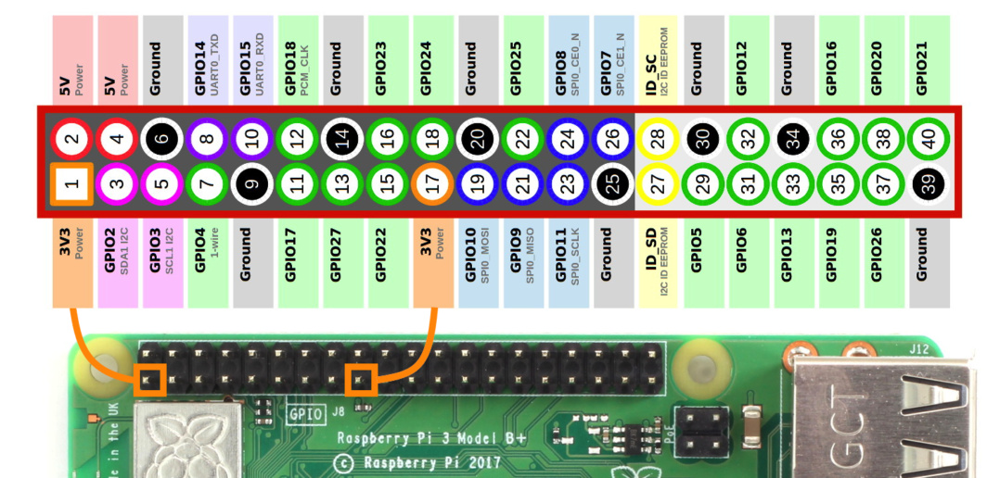

# Home Assistant Bigmoby Add-on: GPIO Shutdown

Home Assistant GPIO add-on to support shutdown command.

## About

With this Home Asssistant addon is possible execute shutdown when a GPIO pin is pulsed.

## Sponsor

Please, if You want support this kind of projects:

<a href="https://www.buymeacoffee.com/bigmoby" target="_blank"></a>

Many Thanks,

Fabio Mauro

## Authors & contributors

Fabio Mauro Bigmoby

For a full list of all authors and contributors,
check [the contributor's page][contributors].

## Installation

GPIO Shutdown add-on is pretty simple.

Follow the following steps for installation & a quick start:

1. Connect your push-push button in a GPIO port. Here the Raspberry Pi pinout: 

1. Search for the "GPIO Shutdown" add-on in the Supervisor add-on store and install it.
1. use the following configuration as example:  
```
shutdown_button_pin: 4
shutdown_trigger_level: 1
pause_before_shutdown_secs: 5
```
1. Save the configuration.
1. Start the "GPIO Shutdown" add-on

## Authors & contributors

Fabio Mauro Bigmoby

For a full list of all authors and contributors,
check [the contributor's page][contributors].

## License

MIT License

Copyright (c) 2021 Fabio Mauro

Permission is hereby granted, free of charge, to any person obtaining a copy
of this software and associated documentation files (the "Software"), to deal
in the Software without restriction, including without limitation the rights
to use, copy, modify, merge, publish, distribute, sublicense, and/or sell
copies of the Software, and to permit persons to whom the Software is
furnished to do so, subject to the following conditions:

The above copyright notice and this permission notice shall be included in all
copies or substantial portions of the Software.

THE SOFTWARE IS PROVIDED "AS IS", WITHOUT WARRANTY OF ANY KIND, EXPRESS OR
IMPLIED, INCLUDING BUT NOT LIMITED TO THE WARRANTIES OF MERCHANTABILITY,
FITNESS FOR A PARTICULAR PURPOSE AND NONINFRINGEMENT. IN NO EVENT SHALL THE
AUTHORS OR COPYRIGHT HOLDERS BE LIABLE FOR ANY CLAIM, DAMAGES OR OTHER
LIABILITY, WHETHER IN AN ACTION OF CONTRACT, TORT OR OTHERWISE, ARISING FROM,
OUT OF OR IN CONNECTION WITH THE SOFTWARE OR THE USE OR OTHER DEALINGS IN THE
SOFTWARE.

[bigmoby]: https://github.com/bigmoby
[original_project]: https://github.com/bigmoby/addon-gpio-shutdown
[contributors]: https://github.com/bigmoby/addon-gpio-shutdown/graphs/contributors
